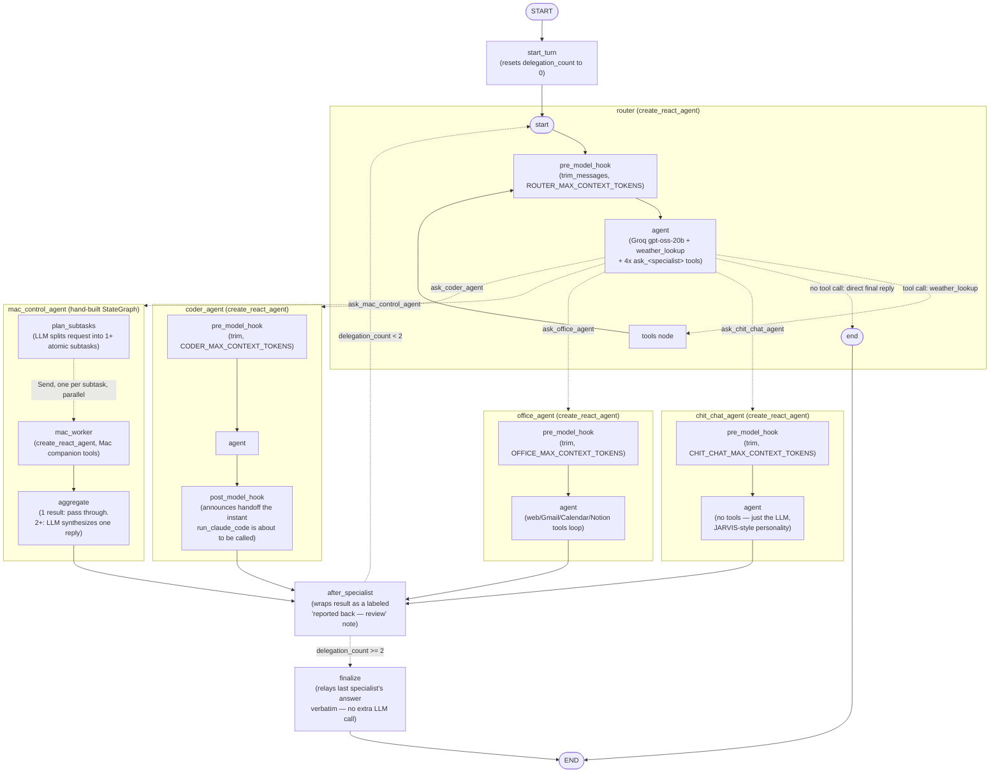

# Maks

A fully agentic Real-Time Conversational Agent — wake-word activated,
**[LangGraph](https://langchain-ai.github.io/langgraph/)-orchestrated**, and
built to actually survive a restart.

Under the hood: a **multi-agent LangGraph supervisor** with a
self-correcting review loop (capped, so it can't loop itself into a
rate-limit wall), backed by a **cosine-similarity embedding router** that
skips the LLM entirely for confident requests, **durable SQLite-checkpointed
memory** with per-agent **sticky sessions** (talk to the same specialist
across turns — it actually remembers, even across a restart), a **dynamic
`Send`-based worker graph** for parallel multi-step Mac control, and
**hands-free Claude Code integration** that narrates its own progress live,
straight from Claude's own structured event stream — no terminal-scraping
hacks. Every tool call runs through real
**[MCP](https://modelcontextprotocol.io) (Model Context Protocol) servers**,
not hand-rolled function-calling glue. Chat runs on **Groq**
(`openai/gpt-oss-20b`) for near-instant responses, voice is **fully
offline** until it's time to speak (Vosk wake-word spotting + faster-whisper
STT), and **Fish Audio** gives it a real voice — all wrapped in a minimal,
Jarvis-style dashboard that's dark until it hears you, then lights up.

**Problems this actually solves**, not just demos:
- **Memory that survives a restart** — not just chat history, per-agent
  sticky threads, via LangGraph's own checkpointer.
- **Routing that costs (basically) nothing** — most requests never hit an
  LLM at all.
- **A supervisor that can't loop forever** — bounded self-correction instead
  of an unbounded review cycle burning through a free-tier rate limit.
- **Hands-free coding, actually narrated** — Claude Code's own event stream,
  not a scraped terminal.

## Architecture, visually



Generated straight from the compiled graph
(`graph.get_graph(xray=True).draw_mermaid()`), not hand-drawn — see
[`architecture.md`](architecture.md) for the full system diagram (voice
pipeline → routing → specialists → MCP servers → persistence) plus a
technology-by-technology breakdown of how everything actually works.

Every non-Mac integration is a real **[MCP](https://modelcontextprotocol.io)
server** — search/weather, Gmail+Calendar, Notion, messaging stubs, and the
Claude handoff all run as *one* consolidated local MCP server over stdio
(`maks/mcp_servers/api_connectors.py`); Mac control runs as a separate MCP
server on the Mac itself, reachable over LAN via MCP's streamable-HTTP
transport. Maks' agents are MCP *clients* that pull their tools from these
servers, not hand-rolled functions.

## What it can do

- **Just talk** — greetings, opinions, general knowledge, handled by
  `chit_chat_agent` (no tools at all — just the LLM).
- **Office work** — web search (DuckDuckGo, no API key), Gmail + Google
  Calendar, Notion (search, read actual page content, query databases,
  create pages, append notes), and WhatsApp/Slack/Outlook messaging stubs
  that explain plainly they're not wired up yet rather than pretending —
  all `office_agent`.
- **Control your Mac over LAN** — "play `<song>` on Spotify", "play
  `<video>` on YouTube", search files, check system health. Handled by a
  **DynamicWorker** (`maks/graph/dynamic_worker.py`): a small LangGraph
  `Send`-based graph that splits a request into 1+ independent subtasks at
  runtime and runs them concurrently (e.g. "open the browser and play a
  song" becomes two workers instead of one sequential loop), instead of a
  fixed agent. Needs the `mac_companion/` service running on the Mac; not
  required — everything else works fine without a Mac around.
- **Hand coding work to Claude** — detects coding requests, tells you it's
  handing off, and shells out to your already-installed Claude Code CLI
  (`coder_agent`).
- **Fast routing, most of the time** — an embedding router (`all-minilm` via
  local Ollama, `maks/graph/router.py`) tries to match an obvious,
  single-intent request straight to a specialist with a cosine-similarity
  lookup, no LLM call at all. Anything ambiguous or that reads as more than
  one task falls back to the full supervisor below, which can actually
  reason about it.
- **Specialists end the turn themselves when they're confident** — a
  specialist's delegate tool returns `Command(goto=END)` directly instead of
  bouncing back to the supervisor for a wrap-up call it isn't changing
  anyway; it only returns to the supervisor when it explicitly signals (via
  a `NEEDS_HANDOFF` sentinel) that finishing the request needs a different
  agent. This is the same primitive `langgraph-swarm` is built on, used
  directly here without the extra dependency — see `maks/graph/supervisor.py`.
- **Custom persona** — edit `config/system_prompt.md` (or the dashboard's
  slide-out settings panel) to change how Maks talks and behaves, live, no
  restart.
- **Jarvis-style dashboard** — dark/dimmed until it hears the wake phrase,
  then powers up: a central animated ring that reacts to state (listening/
  thinking/speaking), a small "what I heard / what Maks said" overlay for
  the current exchange, and a collapsed keyboard icon for typing a command
  when you'd rather not talk. Voice-first, not a chat app.

## Architecture

```
maks/
├── main.py             # wake-word loop + dashboard server, wired together
├── runtime.py            # persistent background asyncio loop (MCP connections live here)
├── mcp_client.py           # connects to every MCP server, groups tools by agent
├── mcp_servers/              # api_connectors.py: every non-Mac MCP tool, one process
├── graph/
│   ├── router.py                 # embedding (all-minilm) fast-path router
│   ├── supervisor.py               # supervisor-as-tools: delegates or handles weather
│   └── dynamic_worker.py             # Send-based DynamicWorker for Mac control
├── agents/                             # chit_chat, office, coder specialists
├── voice/                                # wake word (Vosk), STT (faster-whisper)
└── server/                                 # FastAPI dashboard (WebSocket live events + UI)

mac_companion/           # MCP server that runs ON the Mac (streamable-HTTP,
                          # token-authenticated): Spotify/YouTube/files/system info
```

Wake word + STT are CPU-friendly by default (int8 Whisper); chat and TTS are
hosted (Groq, Fish Audio) — see `.env.example` for the exact models/keys
needed.

**Why a persistent background event loop (`runtime.py`)?** MCP connections
are async and, measured directly: reconnecting a stdio MCP server per tool
call costs ~1.3s, a session opened once and reused costs ~10ms. So
`runtime.py` opens every MCP connection exactly once at startup, on one
event loop that lives for the whole process, and both the (synchronous)
voice loop and the dashboard's `/chat` endpoint dispatch into that loop
rather than each managing their own short-lived connections.

**Why supervisor-as-tools instead of `langgraph-supervisor`, and no
`langgraph-swarm` either?** Checked by reading `langgraph-supervisor`'s
actual source: its supervisor node is itself a full ReAct agent that replays
the *entire* shared conversation into every call and injects synthetic
"transferring to X" / "transferred back" messages into the checkpointed
history on every handoff — both compound turn over turn and were the actual
source of the slowdown, not just raw call count. `maks/graph/supervisor.py`
is instead a single `create_react_agent` whose tools are either direct
(`weather_lookup`) or "delegate" wrappers that run a specialist agent in
isolation and hand back only its final answer — so each specialist gets a
clean, minimal task description instead of the whole conversation, and
nothing synthetic ever enters the history. `langgraph-swarm` was skipped for
a related reason: its peer-to-peer handoffs share one growing conversation
thread across agents by design, which is the opposite of the isolated-task
approach above. Instead, each delegate tool returns `Command(goto=END)`
directly when the specialist is confident — the same primitive swarm's own
handoff tools use internally, without adopting the thread-sharing that comes
with it. This keeps the supervisor's ability to reconsider and delegate to a
different specialist if the first one got it wrong (the exact thing a
one-shot router graph can't do) and lets a confident specialist end the turn
immediately (the exact thing that keeps `langgraph-supervisor` slow), while
the embedding fast-path router in front of it (`maks/graph/router.py`)
skips the supervisor's own LLM call entirely for obvious, single-intent
requests.

---

# Full setup guide (Windows)

Everything below is free — no paid API tier is required anywhere. Do the
steps in order; each one names exactly what it unblocks. (Prefer Ubuntu?
Jump to [Ubuntu / Linux setup](#alternative-ubuntu--linux-setup) below — the
app itself is fully cross-platform, only the install scripts differ.)

## 0. What you'll need before starting

- A Windows laptop (this is the "Maks" box) with a working microphone and
  speaker.
- PowerShell (the built-in one is fine — no need to install anything extra
  for that).
- Python 3.11+ on `PATH` (`python --version` to check).
- Optionally, a Mac on the same Wi-Fi/LAN for the remote-control features
  (YouTube/Spotify/files/system info) — everything else works fine without
  it, and it's fine to set up later (see step 7).
- A free [Groq](https://console.groq.com) API key (chat) and a free
  [Fish Audio](https://fish.audio) API key (TTS) — both no-credit-card free
  tiers, plenty for personal use.
- ~1GB free disk (Whisper model + Vosk model + the local `all-minilm`
  embedding model) — chat and TTS are hosted now, so no multi-GB local LLM
  download.

## 1. Install system packages, create the Python virtualenv

From the project root, in PowerShell:
```powershell
.\scripts\install_windows.ps1
```

This script (safe to re-run, it skips what's already done):
- Creates `.\venv` and `pip install`s `requirements.txt` into it. Everything
  in it — `sounddevice`, `vosk`, `faster-whisper`, `soundfile`,
  `webrtcvad-wheels` — installs from prebuilt wheels on Windows; PortAudio
  ships inside `sounddevice`'s own wheel, so there's no separate native
  audio library to install (unlike Ubuntu's `portaudio19-dev`).
- Copies `.env.example` to `.env` if you don't have one yet.
- Checks whether `ollama` is on `PATH`. Ollama is only needed now for the
  local embedding model the fast-path router uses — chat runs on Groq. If
  `ollama` is missing, the script **prints the download link rather than
  installing it for you**: <https://ollama.com/download/windows>. Run that
  installer yourself, then re-run `.\scripts\install_windows.ps1` — this
  time it'll find `ollama` and pull the embedding model for you:
  ```powershell
  ollama pull all-minilm
  ```

**Verify the embedding model is actually working** before moving on:
```powershell
ollama run all-minilm "hello"
```
If this hangs or errors, fix it before continuing — the fast-path router
needs a working Ollama, though everything still works (just always through
the full supervisor) if you skip this entirely.

## 2. Download the voice model

```powershell
.\scripts\download_voice_models.ps1
```

Downloads into `.\models\`:
- `vosk-model-small-en-us-0.15` (~40MB) — the always-listening wake-phrase
  spotter.

(TTS runs through Fish Audio's cloud API — see step 3 — so there's no local
voice binary to download for that anymore.)

Also safe to re-run; it skips anything already downloaded. When it finishes
it prints the exact `.env` value it expects (already matches the default in
`.env.example`).

## 3. Configure `.env`

Open `.env` (created in step 1) and, at minimum, set:

```
GROQ_API_KEY=<your key>            # free, https://console.groq.com
FISH_AUDIO_API_KEY=<your key>      # free, https://fish.audio
WEATHER_CITY=<your city>           # used in the wake-up greeting
```

**Verify Groq is actually working** before moving on:
```powershell
.\venv\Scripts\python.exe -c "from maks.llm import get_llm; print(get_llm().invoke('say hello in 5 words').content)"
```
You should get a short reply printed back, quickly. If this errors, fix it
before continuing — nothing downstream will work without a working
`GROQ_API_KEY`.

**Verify Fish Audio TTS standalone** (quick, catches a bad key/voice id
early):
```powershell
.\venv\Scripts\python.exe -c "from maks.voice.tts import speak; speak('testing one two three')"
```
You should hear it spoken through your default speaker.

If you're setting up the Mac companion (step 7), you'll also set
`MAC_COMPANION_URL`/`MAC_COMPANION_TOKEN` — fine to skip both for now, Maks
runs without them.

Leave the Google/Notion/LangSmith sections for steps 4, 5, and 9 — Maks
starts and runs fine without them; those specific tools just won't work
until configured (they fail with a clear spoken/dashboard message, not a
crash).

## 4. Google (Gmail + Calendar) — free OAuth client

1. Go to <https://console.cloud.google.com/>, create a project (or reuse one
   you have).
2. Left sidebar → **APIs & Services → Library** → search for and **enable**
   both **Gmail API** and **Google Calendar API**.
3. **APIs & Services → OAuth consent screen**:
   - User type: **External**.
   - Fill in the required app name/support email fields (anything reasonable
     — this app is only ever used by you).
   - Under **Test users**, add your own Google account's email address. This
     keeps the app in "Testing" mode, which is free and doesn't require
     Google's app review, but only works for accounts you explicitly listed
     as test users.
4. **APIs & Services → Credentials → + Create Credentials → OAuth client ID**:
   - Application type: **Desktop app**.
   - Name it anything (e.g. "Maks").
   - Click **Create**, then **Download JSON**.
5. In PowerShell, from the project root:
   ```powershell
   New-Item -ItemType Directory -Force -Path secrets
   Move-Item "$env:USERPROFILE\Downloads\client_secret_*.json" secrets\google_credentials.json
   ```
6. That's it for setup — no `.env` changes needed for Google specifically
   (`GOOGLE_CREDENTIALS_PATH`/`GOOGLE_TOKEN_PATH` already default to
   `./secrets/...`). The **first time** Maks actually calls a Gmail/Calendar
   tool, it will print a URL / open a browser for you to approve access once;
   after that a token is cached at `secrets/google_token.json` and silently
   refreshed — you won't be asked again.

## 5. Notion — free integration token

1. Go to <https://www.notion.so/my-integrations> → **+ New integration**.
   - Name it anything (e.g. "Maks").
   - Associated workspace: your workspace.
   - Capabilities: leave the defaults (read/insert/update content).
2. Click **Submit**, then copy the **Internal Integration Token** shown
   (starts with `ntn_` or `secret_`).
3. Paste it into `.env`:
   ```
   NOTION_TOKEN=ntn_...your token...
   ```
4. In Notion itself, open **each page or database** you want Maks to be able
   to see: **"..." menu (top right) → Connections → connect to → your
   integration name**. Notion integrations can only see pages explicitly
   shared with them this way — if Maks says it can't find something, this is
   almost always why.
5. Maks can do more than search titles: `notion_get_page_content` reads a
   page's actual text (headings, paragraphs, lists, to-dos), and
   `notion_query_database` lists a database's rows with their properties —
   ask it something like "what's in my [page name] page" to exercise this.

## 6. Coding handoff (Claude Code)

Nothing to install — Maks shells out to the `claude` CLI you already have.
Just confirm, in PowerShell:
```powershell
Get-Command claude
claude --version
```
If that's not found, make sure Claude Code is installed and on `PATH`.

In `.env`, set `CLAUDE_DEFAULT_PROJECT_DIR` to wherever your coding projects
live, e.g.:
```
CLAUDE_DEFAULT_PROJECT_DIR=~/projects
```
If you mention a specific project by name/path when talking to Maks, that's
used as the working directory instead of the default.

If Claude Code stops on a permission prompt during a handoff (since `-p`
print-mode is non-interactive and can't answer an approval prompt itself),
configure an allowlist for the tools you want it to use freely, in that
project's own `.claude/settings.json`.

## 7. Mac companion (optional — lets Maks control your Mac)

Deprioritize this if you don't have a Mac handy yet; everything else works
without it, and `mac_control_agent` just has no tools until you set it up.

This installs an MCP server on the Mac itself, reachable over your LAN. On
the **Mac**:

```bash
# get the mac_companion/ folder onto the Mac — AirDrop, git, scp, USB, whatever
cd mac_companion/install
chmod +x install.sh
./install.sh
```

This script creates a Python venv on the Mac, generates a random shared
token (prints the exact line to copy into the Windows box's `.env`), and
installs a `launchd` job so it starts automatically and stays running.
Verify it's up: `curl http://localhost:8765/health` should print `ok`.

Back on the **Windows box**, set in `.env`:
```
MAC_COMPANION_URL=http://<the-mac's-lan-ip>:8765
MAC_COMPANION_TOKEN=<the token printed by install.sh>
```
**These two tokens must match exactly.** Since Maks connects to the Mac
companion once at startup and keeps that connection open (see "why a
persistent event loop" above), **make sure the Mac companion is already
running before you start Maks** — if it comes online later, restart Maks to
pick it up.

## 8. Run it

From the project root, in PowerShell:
```powershell
.\venv\Scripts\python.exe -m maks.main
```

You should see, in order:
```
[maks] warming up the local model, agents, and MCP servers…
[maks] ready — listening for the wake phrase: 'daddy's home'
```
(plus one `[mcp_client] Couldn't connect to the 'mac' MCP server...` line if
the Mac companion isn't running yet — expected, not fatal; every other agent
still works.)

Open `http://localhost:8420` in a browser — you should see the dashboard:
dim/dark (it's waiting for the wake phrase), "connected" indicator top-left,
a small gear icon top-right for persona settings, and a small keyboard icon
bottom-left for typing a command instead of talking.

Say **"daddy's home"** near the mic. The screen should light up, you should
hear a spoken greeting with live weather, then the ring switches to
listening. Say a command, pause when you're done — Maks should stop
listening promptly, not keep recording; the bottom-right corner shows what
it heard and Maks' reply as it comes in. When it's done it dims back down,
waiting for the phrase again.

**To run it automatically at logon**, register it as a Scheduled Task
(built into Windows, no extra tooling):
```powershell
.\scripts\install_task.ps1
```
Check on it / view info: `Get-ScheduledTask -TaskName Maks | Get-ScheduledTaskInfo`.
Remove it: `Unregister-ScheduledTask -TaskName Maks -Confirm:$false`.

## 9. LangSmith (optional) — see every agent decision traced

[LangSmith](https://smith.langchain.com) is LangChain's tracing/observability
platform — free tier is generous and plenty for personal use. Once enabled,
every time Maks handles a command you get a full trace: whether the
supervisor answered directly or delegated (and to whom), every tool call
with its arguments and return value, latency per step, and errors if
something failed silently.

**Already wired up and on by default** in `.env.example`/`.env` — you just
need to drop in your own key:
```
LANGSMITH_TRACING=true
LANGSMITH_API_KEY=paste-your-langsmith-api-key-here
LANGSMITH_PROJECT=maks
```
1. Sign up free at <https://smith.langchain.com>.
2. **Settings → API Keys → Create API Key**, copy it.
3. In `.env`, paste it over the `LANGSMITH_API_KEY` placeholder above (it's
   already uncommented — nothing else to edit).
4. Restart Maks. **No code changes are needed** — `langchain-core` reads
   these variables straight from the process environment, and
   `maks/settings.py` explicitly loads `.env` into the environment (via
   `python-dotenv`) specifically so this works without extra wiring. If you'd
   rather not trace at all, set `LANGSMITH_TRACING=false`.
5. Say something to Maks, then check <https://smith.langchain.com> → your
   "maks" project. You'll see a new trace per command: whether it delegated,
   and every step the chosen specialist took, as nested spans.

Note: this traces the LangChain/LangGraph layer (LLM calls, routing, tool
invocations) — it does not trace the raw voice pipeline itself (wake-word
detection, STT, TTS), since those aren't LangChain operations. Terminal
output is still the right place to watch that part.

## 10. Tuning the wake word and mic behavior

- `.env` → `WAKE_PHRASE` — what to fuzzy-match against (default
  `daddy's home`). Change it to anything — it's fuzzy-matched, doesn't need
  to be exact.
- `.env` → `WAKE_MATCH_THRESHOLD` — 0–100, higher = stricter (fewer false
  triggers, but might miss you in a noisy room). Start at 78 and adjust.
- `.env` → `VAD_AGGRESSIVENESS` — 0 (least aggressive) to 3 (most), how hard
  it filters non-speech before either the wake-word listener or the command
  listener considers it. Default 3. This is what stops background noise
  (TV, hum, a door closing) from being misheard as speech in the first
  place — the wake listener specifically only ever checks for a match on
  frames classified as actual speech, never on silence/noise, no matter what
  the ASR transcript says it heard.
- `.env` → `COMMAND_SILENCE_SECONDS` — how much trailing silence ends a
  recorded command after you stop talking. Default 0.9s. If it's cutting you
  off mid-sentence, raise it a bit; if it's still recording well after
  you've stopped, lower it or raise `VAD_AGGRESSIVENESS`.
- The persona/behavior (what Maks says, how it talks) lives in
  `config/system_prompt.md`, or the dashboard's settings panel (gear icon,
  top-right) — edit it freely, no restart needed.

---

# Testing your MCP tools with MCP Inspector

Every non-Mac integration in Maks lives in one consolidated MCP server
(`maks/mcp_servers/api_connectors.py`), so you only need to start **one
process** to test everything — weather, web search, Gmail, Calendar,
messaging stubs, Notion, and the Claude handoff — using the official
**[MCP Inspector](https://modelcontextprotocol.io/docs/tools/inspector)**.
This is the single most useful way to debug "why didn't Maks do X": call the
tool directly and see the raw result.

**Prerequisite**: Node.js 22.19 or newer (`node --version` to check; install
from <https://nodejs.org> if needed). `npx` runs the Inspector with no
separate install step.

All commands below assume you're in the project root with the venv already
set up (step 1 above).

## The easy way: `mcp.json`

The project root has an `mcp.json` catalog file listing both servers
(`connectors` and `mac`) in the standard MCP client config shape. Edit the
`mac` entry's `url`/token placeholders if you're testing the Mac companion,
then:

```powershell
# web UI, pick a server interactively
npx @modelcontextprotocol/inspector --config mcp.json

# or go straight to it
npx @modelcontextprotocol/inspector --config mcp.json --server connectors

# CLI mode, no browser
npx @modelcontextprotocol/inspector --cli --config mcp.json --server connectors --method tools/list
```

## Ad-hoc, without the config file

Web UI (opens a full graphical inspector in your browser):
```powershell
npx @modelcontextprotocol/inspector .\venv\Scripts\python.exe -m maks.mcp_servers.api_connectors
```
This prints a URL containing a one-time session token — open it. In the
**Tools** tab you'll see all ~16 tools listed (`weather_lookup`,
`web_search`, `fetch_page`, `gmail_search`, `gmail_send`,
`calendar_list_events`, `calendar_create_event`, `whatsapp_send`,
`slack_send`, `outlook_send`, `notion_search`, `notion_create_page`,
`notion_append_text`, `notion_get_page_content`, `notion_query_database`,
`run_claude_code`); click one, fill in its arguments, hit **Run Tool**, and
see the real result.

**CLI mode** (scriptable, no browser — good for a quick sanity check):
```powershell
# list every tool
npx @modelcontextprotocol/inspector --cli .\venv\Scripts\python.exe -m maks.mcp_servers.api_connectors --method tools/list

# actually call one
npx @modelcontextprotocol/inspector --cli .\venv\Scripts\python.exe -m maks.mcp_servers.api_connectors --method tools/call --tool-name weather_lookup --tool-arg city=Tokyo

# exercise the Notion content-reading tools
npx @modelcontextprotocol/inspector --cli .\venv\Scripts\python.exe -m maks.mcp_servers.api_connectors --method tools/call --tool-name notion_search --tool-arg query=Meeting
npx @modelcontextprotocol/inspector --cli .\venv\Scripts\python.exe -m maks.mcp_servers.api_connectors --method tools/call --tool-name notion_get_page_content --tool-arg page_id=<id-from-search>
```

If a tool needs credentials that aren't configured yet (Google OAuth, Notion
token), you'll get back the same plain-English error message Maks itself
would speak — that's the tool working correctly, just unconfigured.

## Testing the Mac companion (streamable-HTTP, token-authenticated)

From the Windows box, or any machine on the same LAN with Node installed:

```powershell
npx @modelcontextprotocol/inspector --server-url http://<mac-lan-ip>:8765/mcp --transport http --header "X-Maks-Token: <your MAC_COMPANION_TOKEN>"
```

CLI form:
```powershell
npx @modelcontextprotocol/inspector --cli --server-url http://<mac-lan-ip>:8765/mcp --transport http --header "X-Maks-Token: <your MAC_COMPANION_TOKEN>" --method tools/list

# call system_info to confirm end-to-end connectivity + auth
npx @modelcontextprotocol/inspector --cli --server-url http://<mac-lan-ip>:8765/mcp --transport http --header "X-Maks-Token: <your MAC_COMPANION_TOKEN>" --method tools/call --tool-name system_info
```

If you get exit code `3` / an `auth_required` error, the token doesn't
match — double check `MAC_COMPANION_TOKEN` is identical on both machines. If
you get exit code `4` / "server unreachable", the companion isn't running or
isn't reachable on that IP/port.

---

# Alternative: Ubuntu / Linux setup

The app itself is fully cross-platform (sounddevice/vosk/faster-whisper all
work the same way, and Groq/Fish Audio are both plain HTTP APIs); only the
install scripts differ.

```bash
bash scripts/install_ubuntu.sh
bash scripts/download_voice_models.sh
cp .env.example .env   # then edit GROQ_API_KEY / FISH_AUDIO_API_KEY / WEATHER_CITY
./venv/bin/python -m maks.main
```

To run permanently in the background / on boot, use the systemd `--user`
unit instead of Task Scheduler:
```bash
mkdir -p ~/.config/systemd/user
cp scripts/maks.service ~/.config/systemd/user/maks.service
systemctl --user daemon-reload
systemctl --user enable --now maks.service
loginctl enable-linger "$USER"    # so it also starts before you log in
```
Logs: `journalctl --user -u maks.service -f`.

Everything else (Google/Notion/Mac companion/LangSmith/MCP Inspector) works
identically — just swap PowerShell commands for their bash equivalents (e.g.
`./venv/bin/python` instead of `.\venv\Scripts\python.exe`).

---

# Known limitations

- **Chat, TTS, and embeddings are no longer fully local or fully free of
  external dependency** — chat runs on Groq (hosted, free tier) and TTS on
  Fish Audio (hosted, free tier); both need internet and an account. Wake
  word (Vosk) and STT (faster-whisper) are still fully offline. This was a
  deliberate trade of the original "fully local" design for lower latency —
  see `maks/graph/supervisor.py`'s module docstring for the reasoning.
- **WhatsApp, Slack, and Outlook** aren't wired up (no credentials
  configured) — the tools exist (in `maks/mcp_servers/api_connectors.py`)
  but always explain that plainly instead of pretending to send.
- Offline STT quality is good but not state-of-the-art; Vosk/faster-whisper
  were chosen specifically to keep the voice-input side free and local.
- The wake phrase is fuzzy-matched via a lightweight always-listening
  transcriber (Vosk), not a dedicated wake-word model — expect occasional
  false triggers/misses; adjust `WAKE_MATCH_THRESHOLD` to taste. It's
  VAD-gated (see "Tuning the wake word" above) to cut down on background
  noise triggering it, but VAD isn't a perfect classifier for every kind of
  noise — `VAD_AGGRESSIVENESS` is there to tune further for your room.
- MCP server connections are made once at startup and held open (for speed —
  see "why a persistent event loop" above). If the Mac companion goes
  offline mid-session and comes back, restart Maks to reconnect
  `mac_control_agent`'s tools. Same idea for Google/Notion credentials
  configured after Maks has already started — those are read lazily on
  first real use, not at startup, so no restart needed for those two.
- Conversation history is durable now: `maks/graph/supervisor.py` backs the
  real app with a single `AsyncSqliteSaver` (`maks_memory.sqlite`, gitignored
  — created on first run), so both the router's own conversation and each
  sticky specialist's thread (see below) survive a restart of
  `python -m maks.main`. `langgraph dev`/Studio still uses a fresh in-memory
  `MemorySaver` per run — durability doesn't matter for that testing tool.
- The supervisor caps how much conversation history is fed into its own
  model call via token-aware trimming (`ROUTER_MAX_CONTEXT_TOKENS`, default
  3000) rather than a flat message count — very long-running sessions will
  gradually lose the earliest context, a deliberate speed/memory trade-off,
  not a bug.
- The embedding fast-path router (`maks/graph/router.py`) is also the
  "sticky session" mechanism: a confident single-intent match sends the
  utterance straight to `chit_chat_agent`, `office_agent`, or `coder_agent`
  addressed by that agent's own stable thread id (`SPECIALIST_THREAD_IDS` in
  `maks/graph/state.py`), so a specialist you've talked to before actually
  remembers earlier turns — via its *own* checkpointed thread and its own
  token budget (`CHIT_CHAT_MAX_CONTEXT_TOKENS`, `OFFICE_MAX_CONTEXT_TOKENS`,
  `CODER_MAX_CONTEXT_TOKENS`), not the router's. There's no explicit
  "un-stick" step — the embedding router re-checks fresh every single turn,
  so drifting to a different kind of request naturally falls through to the
  full supervisor graph instead. `mac_control_agent` is deliberately
  excluded from stickiness: its DynamicWorker graph
  (`maks/graph/dynamic_worker.py`) accumulates per-request results via an
  `operator.add` reducer meant to live only within one request's fan-out —
  giving it a persistent thread would leak results across unrelated Mac
  requests, so it stays fully isolated per call, same as before this
  feature. Sticky/fast-routed turns still aren't part of the *router's* own
  top-level conversation history — a deliberate simplicity trade-off, not a
  bug. If any of this ever matters in practice, raise
  `ROUTER_SIMILARITY_THRESHOLD` to fast-path (and stick) less, or lower it
  to do so more.
- Handing a coding task to `coder_agent` runs Claude Code headlessly
  (`run_claude_code` in `maks/mcp_servers/api_connectors.py`, via `claude -p
  ... --output-format stream-json`) and narrates it live: Maks speaks the
  handoff the instant it decides to delegate, then speaks a short update
  for each significant action Claude takes (editing a file, running a
  command, searching the code, ...) as it happens, via a small localhost
  bridge (`POST /internal/narrate` on the dashboard — the MCP server runs
  in a separate process and can't reach the event bus/speaker directly).
  Once Claude finishes, the reply is Claude's own real summary of what it
  did, not just a completion marker. Trade-off: this is headless, so a tool
  call that needs permission approval will hang with no one to prompt —
  `CLAUDE_PERMISSION_MODE` opts into a specific permission mode (e.g.
  `acceptEdits`) if you want fully hands-off automation; left unset by
  default since that's a real trust decision. `coder_agent`'s own prompt
  also tells it not to re-delegate the same request once it has a real
  result — combined with the delegation cap below, this keeps a coding
  turn from opening a second Claude Code run on its own.
- A single turn caps how many times it can bounce specialist → router →
  specialist before forcing a reply (`MAX_DELEGATIONS_PER_TURN`, currently
  2, in `maks/graph/supervisor.py`) — otherwise the router's own "is this
  good enough?" judgment call is the only thing standing between one
  delegation and an unbounded chain of them, which combines badly with
  Groq's tight free-tier rate limit (a re-delegation right as the limit is
  hit can turn into the whole turn silently retrying with backoff for the
  better part of a minute, which looks exactly like a hang). Past the cap,
  the last specialist's own answer becomes the final reply directly, with
  no extra model call.
