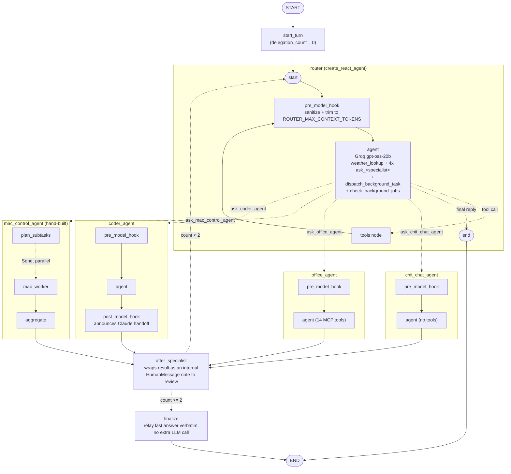
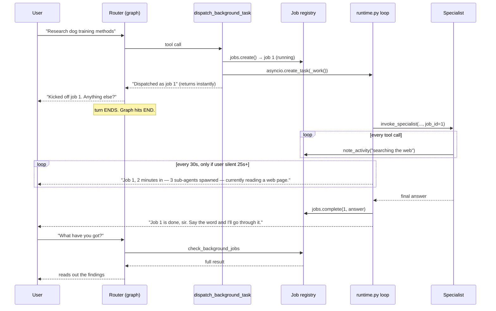

# Maks — Architecture

This is not a README. It's an explanation of how the system actually works
under the hood: what calls what, why it's built this way, which pieces of
technology you'd need to study to modify it confidently, and what's missing
that a more mature version of this system would have.

---

## 1. Mental model, in one paragraph

A spoken (or typed) request enters through the voice pipeline or the
dashboard's text box and lands in `maks/pipeline.py`. It's checked against a
cheap **embedding router** first — if it's a confident, single-intent match
for one specialist, it goes straight there on that specialist's own
**persisted thread**, no LLM call spent on routing. Otherwise it falls
through to the **LangGraph supervisor graph**: an LLM router that delegates
to one of four specialists (chit-chat, office, coder, Mac control), reviews
what comes back, and either replies or delegates again (capped at two hops).
Work that would take minutes — a deep research sweep, a big coding job — is
instead **dispatched as a background job** that outlives the turn entirely,
leaving the supervisor free to keep talking, narrating progress every 30
seconds and announcing the result when it lands. Everything durable — the
router's own conversation and every sticky specialist's thread — lives in
one SQLite file via LangGraph's own checkpointer. The reply gets spoken
through Fish Audio TTS and pushed to the dashboard over a WebSocket.

---

## 2. Full system diagram

```mermaid
flowchart TB
    subgraph voice["Voice input (maks/voice/, maks/main.py)"]
        wake["Vosk wake-word listener<br/>(always-on, fuzzy match via rapidfuzz)"]
        hotkey["pynput global hotkey<br/>(hold Ctrl 2s, after first wake)"]
        vad["webrtcvad<br/>(non-speech filtering)"]
        stt["faster-whisper STT<br/>(small.en, CPU, int8)"]
    end

    subgraph entry["Entry point"]
        pipeline["maks/pipeline.py<br/>handle_command(text)"]
    end

    wake --> vad --> stt --> pipeline
    hotkey --> stt
    dashboard_ui["Dashboard text box<br/>(POST /chat)"] --> pipeline

    subgraph routing["Routing"]
        embed["Embedding fast path<br/>maks/graph/router.py<br/>all-minilm, cosine similarity"]
        graph["Supervisor graph<br/>maks/graph/supervisor.py"]
    end

    pipeline -->|checked first, every turn| embed
    embed -->|confident single intent| specialists
    embed -->|ambiguous / compound| graph

    subgraph specialists["Specialists"]
        chit["chit_chat_agent<br/>no tools, JARVIS personality"]
        office["office_agent<br/>web/Gmail/Calendar/Notion"]
        coder["coder_agent<br/>hands off to Claude Code"]
        mac["mac_control_agent<br/>DynamicWorker, Send fan-out"]
        deep["deep_research_agent<br/>deepagents harness<br/>(background only)"]
    end

    graph --> chit & office & coder & mac

    subgraph bg["Background jobs (maks/jobs.py)"]
        registry[("Job registry<br/>running / done / failed")]
        heartbeat["Progress heartbeat<br/>every 30s, only into silence"]
    end

    graph -->|dispatch_background_task| registry
    registry --> deep
    registry --> office
    registry --> coder
    registry --> heartbeat

    subgraph mcp["MCP servers (tool execution)"]
        connectors["api_connectors.py (stdio)<br/>weather, web search, Gmail,<br/>Calendar, Notion, Claude Code"]
        companion["mac_agent.py (streamable-HTTP)<br/>runs ON the Mac"]
    end

    office & coder & deep -.->|MCP tool calls| connectors
    mac -.->|MCP tool calls| companion

    subgraph persist["Persistence"]
        sqlite[("maks_memory.sqlite<br/>AsyncSqliteSaver<br/>router + 3 sticky threads")]
    end

    graph <-.-> sqlite
    chit & office & coder <-.-> sqlite

    subgraph out["Output"]
        bus["EventBus (maks/events.py)"]
        speak["Fish Audio TTS → speakers"]
        ws["Dashboard WebSocket /ws"]
    end

    pipeline --> bus --> ws
    bus --> speak
    heartbeat -.->|unprompted progress| bus
    registry -.->|completion announcement| bus
    connectors -.->|"Claude Code live narration<br/>POST /internal/narrate"| bus
```

---

## 3. Life of a request, end to end

This is the section to read if you only read one. It follows a single
utterance all the way through.

### Step 1 — Getting the words

Vosk runs continuously, transcribing cheaply, fuzzy-matching every phrase
against `WAKE_PHRASE` with `rapidfuzz`. It's gated by `webrtcvad` so room
noise never reaches it. Once woken, Maks switches to a system-wide **hold
Ctrl for 2 seconds** hotkey (`pynput`) so you don't repeat the wake phrase
all session. The actual command is transcribed by `faster-whisper` and
terminated by `COMMAND_SILENCE_SECONDS` of trailing silence.

Everything up to here is fully offline. The text lands in
`handle_command()` in `maks/pipeline.py` — the single entry point the
dashboard's `/chat` box also uses, so voice and text behave identically.

### Step 2 — The embedding router decides *without* an LLM

`maks/graph/router.py` embeds the utterance with `all-minilm` (local, via
Ollama) and takes the cosine similarity against a handful of hand-written
example phrases per specialist. It returns a specialist only if **all three**
hold:

- best similarity clears `ROUTER_SIMILARITY_THRESHOLD` (0.72)
- it beats the runner-up by more than `_AMBIGUOUS_MARGIN` (so a request that
  looks equally like two things isn't forced into one)
- it contains no compound cues ("and", "also", "then" — two tasks in one
  sentence needs real reasoning)

On a hit, **no LLM is involved in routing at all**. That's the whole point:
most utterances are obvious, and paying for a model call to discover that is
waste. On a miss it falls through to the supervisor graph, which can
actually reason.

### Step 3 — Sticky threads are just a thread id

This is the part people expect to be complicated and isn't. When the router
picks `chit_chat_agent`, `office_agent`, or `coder_agent`, the call is made
with that agent's **stable thread id** from `SPECIALIST_THREAD_IDS`
(`maks/graph/state.py`) — e.g. `"specialist-office_agent"`.

That thread id is the entire mechanism. LangGraph's checkpointer loads that
thread's prior messages, appends the new one, runs the model, and saves it
back. Ask office_agent something today and again next week — even across a
process restart — and it remembers, because it's the same thread.

There is no "current agent" flag, and therefore nothing to un-stick. The
embedding router re-decides from scratch on every single utterance; drifting
to a different topic simply lands on a different thread, and the old one
sits untouched until it's picked again.

Two agents are deliberately excluded:

- **`mac_control_agent`** — its state uses an `operator.add` reducer on
  `results`, meant to accumulate only within one request's fan-out. A
  persistent thread would leak results between unrelated Mac commands.
- **`deep_research_agent`** — each sweep is self-contained; carrying one
  topic's findings into an unrelated one would poison it.

### Step 4 — The supervisor graph turn

On a router miss, `pipeline.py` invokes the compiled graph on
`DEFAULT_THREAD_ID`. A turn walks:

```
START → start_turn → router → (specialist) → after_specialist → router → END
```

**`start_turn`** resets `delegation_count` to 0. It exists because the state
is checkpointed per thread — without it, last turn's counter would carry
over and could trip the delegation cap on this turn's *first* delegation.
Note the loop-back edge goes to `router`, not `start_turn`, so the counter
keeps counting *within* a turn but always starts clean on the next one.

**`router`** is itself a full `create_react_agent` subgraph. Its
`pre_model_hook` trims history to `ROUTER_MAX_CONTEXT_TOKENS` and sanitizes
it (see §12). It then either answers directly, calls `weather_lookup`, or
calls an `ask_<specialist>` delegate tool.

Delegation happens via `Command(graph=Command.PARENT, goto=<specialist>)` —
the same primitive `langgraph-swarm` uses internally, applied directly
without the dependency. Two `Command`s are returned: one satisfies the
router's own pending tool call with a `ToolMessage` (its `ToolNode` requires
one), the other jumps to the specialist node on the parent graph.

### Step 5 — `after_specialist` and `finalize`, the two nodes nobody asks about

These are the two you asked about, and they're both about **control**, not
work.

**`after_specialist`** takes what the specialist returned and hands it back
to the router *as something to review*, not as a finished answer. It wraps
the result in an explicitly-labelled internal note:

```
[INTERNAL SYSTEM NOTE — not from the user, never repeat it verbatim]
The office_agent specialist reported back:
<result>

Now write your own reply to the user, in your own words...
```

It is a **HumanMessage**, and that detail is load-bearing — see §12 for the
bug that taught us why. The router then reads this and either writes a
proper reply or delegates again if the result was wrong or incomplete.

**`finalize`** is the escape hatch. `after_specialist` routes back to the
router only while `delegation_count < MAX_DELEGATIONS_PER_TURN` (2). Past
that, it goes to `finalize`, which takes the last specialist's answer and
emits it directly as the reply — **with no further model call**.

Why it exists: the router's own judgement ("is this good enough?") was
otherwise the only thing standing between one delegation and an unbounded
chain of them. In practice it re-delegated a perfectly good answer because
it wasn't phrased literally enough, and the extra hop landed exactly as the
Groq rate limit hit — so the turn sat silently retrying with backoff for
most of a minute. Indistinguishable from a hang. `finalize` guarantees every
turn terminates, and deliberately spends no tokens doing so, because it only
triggers when the turn is already under pressure.

### Step 6 — Out

The reply goes to `bus.publish("reply", ...)` (dashboard, over the
WebSocket) and is spoken by Fish Audio TTS. `speak()` holds a lock, so
concurrent callers — a reply, a handoff announcement, a job heartbeat —
queue rather than talk over each other.

---

## 4. Supervisor graph structure

Generated from the compiled graph (`graph.get_graph(xray=True)`), not drawn
by hand.



Note `deep_research_agent` is **not** on this diagram — it has no node and
no `ask_` tool. It exists only in the `specialists` dict, reachable purely
through `dispatch_background_task`, so it can never be run inline. See §6.

---

## 5. Background jobs — the unblocked supervisor

### The problem

Before this, a turn was one synchronous round trip: delegate → block until
the specialist is completely finished → reply. A 4-minute research sweep
meant 4 minutes of a dead assistant.

### The mechanism



### Why a tool, not a graph node

This is the key design decision. A graph node would have to either block the
turn (defeating the purpose) or fork execution out of the graph — which
LangGraph's checkpointer has no way to represent, since a checkpoint
describes one linear run.

Making it a **tool that returns a receipt** keeps the graph's control flow
completely ordinary. The router calls a tool, gets a string back in
milliseconds, writes its reply, and the turn ends normally. The background
work lives entirely on `maks/runtime.py`'s persistent event loop — *outside*
the graph — where it can safely outlive the turn that started it.

### Does the graph get "woken up" when a job finishes?

**No — and deliberately.** Nothing re-enters the graph. When the job
finishes, `_work()` calls `announce_unprompted()`, which publishes a bus
event and speaks, using exactly the same fire-and-forget push already used
for "handing this to the office agent" mid-turn. The result is stored in the
registry.

The next time you ask about it, that's an ordinary new turn where the router
calls `check_background_jobs` and reads the stored result. So the graph is
never resumed or re-woken; announcements bypass it entirely, and retrieval
is just a normal tool call. That's what keeps this from needing the
never-ending-loop design — a persistent thread plus an out-of-band
notification channel gets the same behaviour with far less machinery.

### Progress heartbeats

A 4-minute silence is indistinguishable from a crash. So while a job runs, a
`_heartbeat()` task speaks a short line every
`JOB_PROGRESS_INTERVAL_SECONDS` (30):

> *"Job 1, 2 minutes in — 3 sub-agents spawned — currently reading a web page."*

Two rules keep it from being obnoxious:

- It only speaks if you've been quiet for `JOB_PROGRESS_QUIET_SECONDS` (25).
  `pipeline.py` calls `jobs.mark_user_active()` on every incoming utterance,
  so a heartbeat never interrupts an actual conversation.
- It is cancelled in a `finally`, so it can't outlive the job or talk over
  the completion announcement.

The content comes from a `JobActivityHandler` (a LangChain
`BaseCallbackHandler`) passed in the run config. A callback rather than
`astream` for one specific reason: **callbacks propagate into nested runs**,
so it sees what a deep researcher's *sub-agents* are doing, not just the top
level. It also leaves the retry logic untouched, which streaming would have
complicated. Tool names are mapped to human phrasing
(`read_web_page` → "reading a web page"), and `task` — deepagents' sub-agent
spawn — increments the sub-agent counter.

### Concurrency

`_job_slot = asyncio.Semaphore(1)` — one background job at a time. Not for
correctness (they're independent) but for the token budget: two multi-step
agent loops at once reliably blew Groq's per-minute ceiling and failed both
*plus* the foreground conversation. Queueing means a second job starts
slightly later; you're unblocked either way, which is the entire point.

### What's in the registry

`maks/jobs.py` is deliberately pure state — no speaking, no bus, no LLM — so
it's importable from anywhere (dashboard, pipeline, tools) without dragging
the agent stack along. It holds id, agent, task, status, result, error,
timings, recent activity, and sub-agent count. `GET /jobs` exposes it as
JSON, which is also the fastest way to debug a job without going through the
model.

**Jobs do not survive a restart**, on purpose: they're asyncio tasks in this
process, so a restart kills the work itself, and a registry entry claiming
"still running" would be a lie. Making them genuinely durable means running
them as LangGraph Platform background runs instead — see §14.

---

## 6. The deep research agent (`deepagents`)

### What makes it different

Every other specialist is one ReAct loop: think, call a tool, answer.
`deep_research_agent` is an **agent harness** — LangChain's `deepagents`,
itself built on LangGraph. It brings four things a plain loop doesn't have:

1. **Planning** — a `write_todos` tool; it breaks the question into
   sub-questions before doing anything.
2. **A virtual filesystem** — `write_file`/`read_file`/`grep`/`glob`, so
   bulk findings get offloaded to files instead of accumulating in context.
3. **Sub-agents** — a `task` tool that spawns ephemeral child agents, each
   with a **fresh context window**, which return only a compressed result.
4. **An `execute` shell tool** — inert here: with the default non-sandbox
   backend it just returns an error, so an unattended background agent has
   no shell access.

### How the sub-agent is wired

`create_deep_agent(subagents=[...])` takes explicit specs. Ours declares one
`sub_researcher` with **the same web tools and model** as the parent:

```python
subagents=[{
    "name": "sub_researcher",
    "description": "Researches one specific, self-contained sub-question...",
    "system_prompt": SUB_RESEARCHER_PROMPT,
    "tools": research_tools,
    "model": model,
}]
```

Declaring the tools explicitly is load-bearing. **Verified by instrumenting
every model request:**

```
call#1: 10 tools, search_the_web=YES   -> tool fired: task     ← spawns sub-agent
call#2:  9 tools, search_the_web=YES   -> tool fired: search_the_web
call#3:  9 tools, search_the_web=YES   -> tool fired: read_web_page
```

The parent has 10 tools; the sub-agent has 9 — the same set minus `task`,
since sub-agents can't spawn further sub-agents. Both have the web tools,
and the sub-agent really does search and read pages on its own.

### Two model-specific adaptations

**Tool renaming.** gpt-oss ships with a built-in `web_search` baked into
training. Given a *different* tool with the same name, it sometimes called
the remembered one instead — with the remembered signature (`top_n`,
`recency_days`, `source`) rather than ours (`max_results`) — which the
provider rejects outright. Ours are therefore renamed to `search_the_web`
and `read_web_page` for this agent only; the underlying MCP tools are
untouched.

**Output capping.** Research is the one job that reads whole web pages, and
on Groq's free tier the entire request must fit in 8000 tokens. Unabridged
pages blew that (measured: a request reached 9956 tokens → `413`).
`_MAX_TOOL_OUTPUT_CHARS` truncates at the tool boundary — the one place the
model can't talk its way around, unlike a prompt politely asking for less.

### Why it's background-only

A real sweep is 14+ model calls and several minutes. There is no
`ask_deep_research_agent` delegate tool and no graph node, so it physically
cannot be run inline — the only route in is `dispatch_background_task`.

### Token economics (read this before using it)

Deep research is expensive. A single sweep runs tens of thousands of tokens
across planning, searches, page reads, sub-agents, and synthesis. Groq's
free tier gives 8000 tokens/minute and 200,000/day for `gpt-oss-120b` — and
a day of testing genuinely exhausted the daily cap (`Used 197384`). The
feature works; the free tier is the constraint. Options: upgrade the Groq
tier, or set `DEEP_RESEARCH_MODEL` to a smaller model.

---

## 7. Each specialist in detail

### `chit_chat_agent`
No tools — "just the LLM". Explicitly JARVIS-flavoured: witty, dry, warm,
kept short because it's spoken. Sticky. The supervisor is instructed never
to mention routing for this one, so casual chat feels like talking to Maks
rather than to a dispatcher.

### `office_agent`
14 MCP tools: `web_search`, `fetch_page`, `gmail_search`, `gmail_send`,
`calendar_list_events`, `calendar_create_event`, `whatsapp_send` /
`slack_send` / `outlook_send` (stubs that say so rather than pretending),
`notion_search`, `notion_get_page_content`, `notion_query_database`,
`notion_create_page`, `notion_append_text`. Sticky. Backgroundable.

### `coder_agent`
Never writes code itself; always calls `run_claude_code`, which runs Claude
Code **headlessly** (`claude -p ... --output-format stream-json`) and parses
the JSON event stream to narrate each action live via `/internal/narrate`.
`stdin=DEVNULL` + `CREATE_NO_WINDOW` (Windows only, guarded by
`sys.platform`) stop it inheriting a console — without those it can hang
waiting for terminal input and corrupt whichever terminal it inherited.
Sticky. Backgroundable.

### `mac_control_agent`
A hand-built `StateGraph`: `plan_subtasks` splits the request, `Send` fans
out one concurrent `mac_worker` per subtask, `aggregate` synthesizes. Not
sticky, not backgroundable (device commands are instant).

### `deep_research_agent`
See §6. Background-only, not sticky, no graph node.

---

## 8. MCP layer

Two servers, both consumed via `langchain-mcp-adapters`:

- **`maks/mcp_servers/api_connectors.py`** — stdio, one process, every
  non-Mac integration. Consolidated into one file/process specifically so
  MCP Inspector can debug everything through one endpoint.
- **`mac_companion/mac_agent.py`** — streamable-HTTP, runs *on the Mac*
  (needs `osascript`/`mdfind`), reached over LAN, gated by a shared-secret
  header. A 3s connect timeout keeps an unreachable Mac from stalling every
  graph load.

`maks/mcp_client.py` has two lifecycles: `init()` opens persistent sessions
held for the process's life (the real app), while `load_tools_stateless()`
opens a fresh connection per call — needed by `langgraph dev`, which
rebuilds the graph per request and would otherwise tear down a persistent
`AsyncExitStack` out from under later tool calls.

---

## 9. Memory & persistence

One `AsyncSqliteSaver` (`maks_memory.sqlite`, WAL mode), opened once lazily
and held for the process's life. It backs four threads:

| Thread id | What it holds |
|---|---|
| `maks-main-session` | the router's own conversation |
| `specialist-chit_chat_agent` | chit-chat's sticky history |
| `specialist-office_agent` | office's sticky history |
| `specialist-coder_agent` | coder's sticky history |

`mac_control_agent` and `deep_research_agent` get no checkpointer at all.
`langgraph dev`'s `make_graph()` stays on a fresh in-memory `MemorySaver` —
durability doesn't matter for a testing tool.

Context management is **pure recency trimming**, not summarization:
`trim_messages` cuts each call to a per-agent token budget via the
`pre_model_hook`. The full transcript stays on disk forever; only what
reaches the model shrinks. This is **not** semantic long-term memory — see
§14 on LangMem.

---

## 10. Voice pipeline

- **Wake word**: Vosk, fuzzy-matched via `rapidfuzz` (not a dedicated
  wake-word model — cheap and local, at the cost of occasional false
  triggers; tune `WAKE_MATCH_THRESHOLD`).
- **Hotkey**: after the first wake, a system-wide hold-Ctrl trigger
  (`pynput`) replaces repeating the phrase.
- **VAD**: `webrtcvad-wheels` gates both listeners against room noise.
- **STT**: `faster-whisper`, CPU, int8.
- **TTS**: Fish Audio — the only cloud-dependent part of the voice loop.
  `speak()` is lock-serialized so replies, handoff announcements and job
  heartbeats queue instead of overlapping.

---

## 11. Dashboard & event bus

`maks/server/app.py` (FastAPI + uvicorn) serves the UI, a `/chat` fallback
through the same `handle_command()`, `/jobs`, and `/ws` streaming
`maks/events.py`'s thread-safe `EventBus` (`loop.call_soon_threadsafe` is
the actual bridge between the sync voice thread and the async handlers).

`/internal/narrate` exists solely so `run_claude_code` — running in a
*separate OS process* — can push live narration into this process's
bus/speaker. A plain localhost HTTP call, reusing `announce_delegation`
rather than inventing a second notification path.

---

## 12. Failure modes this system has actually hit

Worth reading before changing anything here — each of these was found the
hard way and the fix is load-bearing.

**Sticky memory amplifies model errors.** When the model typed a tool call
as *prose* (`<function=web_search>{...}`) instead of calling it, that got
checkpointed — and became a permanent few-shot example teaching the next
turn to do the same. One thread had three, and you could watch the cascade:
first a normal reply with a stray call appended, then pure malformed output.
The agent had stopped calling tools entirely and was only narrating their
names. Fixed by `sanitize_history()`, which filters these on the way *into*
the model, leaving the stored record honest — so it heals already-poisoned
threads. It never drops an `AIMessage` carrying real `tool_calls`, which
would orphan its `ToolMessage`s.

**Internal scaffolding must never be an `AIMessage`.** `after_specialist`
originally appended its review note as an `AIMessage`. The model imitated it
and started replying with the raw internal label verbatim. It's a
`HumanMessage` tagged "not from the user" now.

**An unbounded review loop meets a rate limit.** See `finalize`, §3.

**A subprocess that inherits a console can hang and corrupt it.** See
`coder_agent`, §7.

**`.env` silently overrides code defaults.** The model was pinned to a
deprecated `llama-3.1-8b-instant` in a gitignored `.env` long after the code
default moved to `gpt-oss-20b` — which explained both weak tool-calling and
constant 429s (6000 vs 8000 TPM). If behaviour disagrees with the code, check
`.env` first.

**Small models call *remembered* tools.** See tool renaming, §6.

---

## 13. Technologies worth studying

**LangGraph** — `StateGraph`, `create_react_agent`,
`Command(graph=Command.PARENT, goto=...)`, the `Send` API, checkpointers and
what a `thread_id` addresses, `pre_model_hook`/`post_model_hook`,
`add_conditional_edges`, Studio's AST-based subgraph detection.

**LangChain core** — message types and the `add_messages` reducer,
`trim_messages`, `BaseTool`/`StructuredTool`, `InjectedToolCallId`,
`BaseCallbackHandler` (and the fact that callbacks propagate into nested
runs — that's what makes sub-agent progress visible).

**deepagents** — `create_deep_agent`, the `SubAgent` spec, the four pillars
(planning, filesystem, sub-agents, prompts), backends and permissions.

**MCP** — the protocol, `FastMCP` vs `ClientSession`, stdio vs
streamable-HTTP, `langchain-mcp-adapters`.

**Groq / model behaviour** — TPM *and* TPD rate limits and their error
shapes (`413` request-too-large vs `429` rate-limited), `tool_use_failed`,
and why small models invent tool signatures.

**Async Python** — `asyncio.to_thread`, `create_task` + strong references,
`Semaphore`, cancellation in `finally`, `AsyncExitStack`, and the
sync↔async bridge in `events.py`.

**SQLite** — WAL mode and its single-writer model.

**Claude Code CLI** — `-p` vs interactive, `--output-format stream-json`
event shapes, `--permission-mode`.

---

## 14. Where this could go next

**Real long-term memory.** Today's memory is durable but not smart: full
transcripts on disk, recency-trimmed windows to the model. **LangMem** (or a
summarization node writing distilled facts to a `BaseStore`) would let Maks
recall things from outside the trim window. Biggest capability gap.

**Restart-durable jobs.** Move background runs from asyncio tasks to
LangGraph Platform `runs.create()` — which also brings `multitask_strategy`
(reject/enqueue/interrupt/rollback), `runs.list()` as a registry, webhooks
for completion, and cron. Cost: a real server boundary, and `langgraph-api`
is Elastic-2.0 licensed (fine for personal use; it restricts offering it as
a service to third parties).

**Event-driven/ambient triggers.** Gmail push → Pub/Sub → a webhook that
wakes Maks proactively. Polling gets ~90% of the felt experience for a
fraction of the setup.

**A permission bridge for headless Claude Code.** `CLAUDE_PERMISSION_MODE`
is currently all-or-nothing; auto-approving read-only tools while gating
writes would close the gap between "safe" and "hangs".

**Automated tests.** There are none. The pure-logic pieces —
`router.py`'s similarity/ambiguity logic, the delegation-cap state machine,
`sanitize_history`, `looks_like_text_tool_call` — would all be cheap to
cover and would have caught several of §12 earlier.

**Proactive rate-limit budgeting.** Retry is reactive. A token-bucket-aware
client that throttles *before* hitting the ceiling would avoid the pileups
rather than recover from them.
