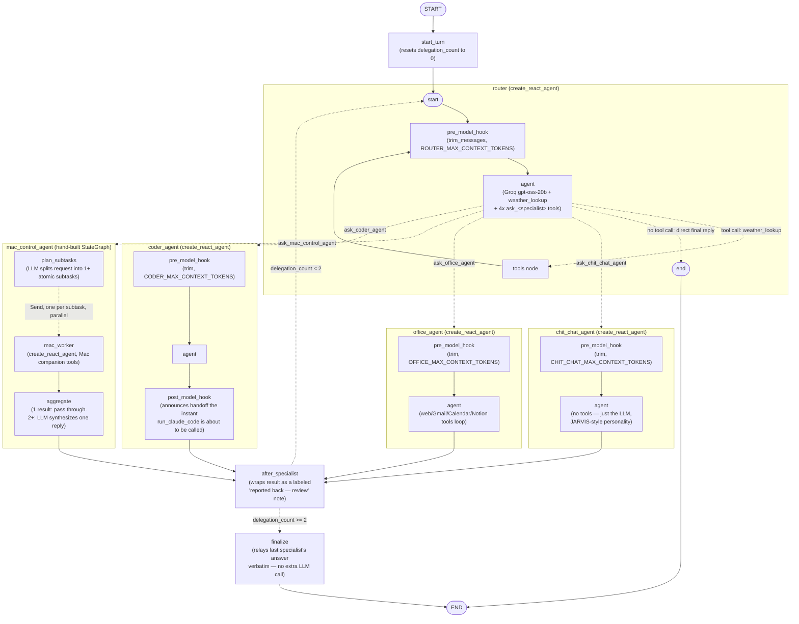

# Maks — Architecture

This is not a README. It's an explanation of how the system actually works
under the hood: what calls what, why it's built this way, which pieces of
technology you'd need to study to modify it confidently, and what's missing
that a more mature version of this system would have.

---

## 1. Mental model, in one paragraph

A spoken (or typed) request enters through the voice pipeline or the
dashboard's text box and lands in `maks/pipeline.py`. It's checked against a
cheap **embedding router** first — if it's a confident, single-intent match
for one specialist, it goes straight there on that specialist's own
**persisted thread**, no LLM call spent on routing. Otherwise it falls
through to the **LangGraph supervisor graph**: an LLM router that delegates
to one of four specialists (chit-chat, office, coder, Mac control), reviews
what comes back, and either replies or delegates again (capped at two
hops). Every specialist either calls tools directly (via MCP servers) or,
for Mac control, fans out into parallel sub-workers. Everything durable —
the router's own conversation and every sticky specialist's thread — lives
in one SQLite file via LangGraph's own checkpointer. The reply gets spoken
through Fish Audio TTS and pushed to the dashboard over a WebSocket.

---

## 2. Full system diagram

```mermaid
flowchart TB
    subgraph voice["Voice input (maks/voice/, maks/main.py)"]
        wake["Vosk wake-word listener\n(always-on, fuzzy match via rapidfuzz)"]
        hotkey["pynput global hotkey\n(hold Ctrl 2s, after first wake)"]
        vad["webrtcvad\n(non-speech filtering)"]
        stt["faster-whisper STT\n(small.en, CPU, int8)"]
    end

    subgraph entry["Entry points"]
        pipeline["maks/pipeline.py\nhandle_command(text)"]
        dashboard_ui["Dashboard text box\n(POST /chat)"]
    end

    wake --> stt
    hotkey --> stt
    vad --> stt
    stt --> pipeline
    dashboard_ui --> pipeline

    subgraph routing["Routing layer"]
        embed["Embedding fast-path router\nmaks/graph/router.py\n(all-minilm via Ollama, cosine similarity)"]
        graph["LangGraph supervisor graph\nmaks/graph/supervisor.py"]
    end

    pipeline -->|every request checked here first| embed
    embed -->|confident single-intent match| specialists
    embed -->|ambiguous / compound / low confidence| graph

    subgraph specialists["Specialists"]
        chit["chit_chat_agent\n(no tools, JARVIS-style personality)"]
        office["office_agent\n(web/Gmail/Calendar/Notion tools)"]
        coder["coder_agent\n(hands off to Claude Code)"]
        mac["mac_control_agent\n(DynamicWorker, Send fan-out)"]
    end

    graph --> chit
    graph --> office
    graph --> coder
    graph --> mac

    subgraph mcp["MCP servers (tool execution)"]
        connectors["api_connectors.py\n(stdio, one process)\nweather, web search, Gmail,\nCalendar, Notion, Claude Code handoff"]
        companion["mac_companion/mac_agent.py\n(streamable-HTTP, runs ON the Mac)\nYouTube/Spotify, file search,\nsystem_info"]
    end

    office -.->|MCP tool calls| connectors
    coder -.->|MCP tool call: run_claude_code| connectors
    mac -.->|MCP tool calls| companion

    subgraph external["External services"]
        groq["Groq API\n(openai/gpt-oss-20b, every agent's LLM)"]
        ollama["Ollama\n(all-minilm embeddings, local)"]
        fish["Fish Audio TTS\n(s2.1-pro-free)"]
        google["Google APIs\n(Gmail, Calendar)"]
        notion["Notion API"]
        claudecli["Claude Code CLI\n(headless, stream-json)"]
        ddg["DuckDuckGo search"]
    end

    chit -.-> groq
    office -.-> groq
    coder -.-> groq
    mac -.-> groq
    embed -.-> ollama
    connectors -.-> google
    connectors -.-> notion
    connectors -.-> claudecli
    connectors -.-> ddg

    subgraph persist["Persistence"]
        sqlite[("maks_memory.sqlite\nAsyncSqliteSaver\n(router thread + 3 sticky specialist threads)")]
    end

    graph <-.-> sqlite
    chit <-.-> sqlite
    office <-.-> sqlite
    coder <-.-> sqlite

    subgraph out["Output"]
        speak["TTS playback\n(Fish Audio → speakers)"]
        bus["EventBus\nmaks/events.py"]
        ws["Dashboard WebSocket /ws"]
    end

    pipeline --> speak
    pipeline --> bus
    bus --> ws
    claudecli -.->|"live progress, mid-run\nPOST /internal/narrate"| bus
```

---

## 3. The two-tier router

**Tier 1 — embedding fast path** (`maks/graph/router.py`)
Every incoming utterance is embedded (Ollama, `all-minilm`, configured via
`EMBEDDING_MODEL`) and compared by cosine similarity against a small set of
hand-written example phrases per specialist (`_ROUTE_EXAMPLES`). If the best
match clears `ROUTER_SIMILARITY_THRESHOLD` (default 0.72) **and** isn't
ambiguous (margin check against the second-best match) **and** doesn't look
like a compound request (`_COMPOUND_CUES` — "and", "also", "then", ...), it
routes straight to that specialist. No LLM call spent on the routing
decision itself — this is the path that makes "sticky" sessions fast.

**Tier 2 — LangGraph supervisor graph** (`maks/graph/supervisor.py`)
Anything the embedding router isn't confident about falls through to a real
LLM (`create_react_agent`, Groq `gpt-oss-20b`) that reasons about routing,
can call `weather_lookup` itself, or delegate via one of four
`ask_<agent>` tools. Delegation happens through
`Command(graph=Command.PARENT, goto=<specialist>)` — the same primitive
`langgraph-swarm` uses internally, applied directly without the dependency
(see the module docstring in `supervisor.py` for the full reasoning on why
`langgraph_supervisor`/`langgraph-swarm` were rejected).

**Sticky sessions**: there is no `current_agent` flag anywhere. Instead,
whenever either tier picks `chit_chat_agent`, `office_agent`, or
`coder_agent`, the call is addressed to that agent's own **stable**
`thread_id` (`SPECIALIST_THREAD_IDS` in `maks/graph/state.py`) on the
shared checkpointer. That specialist's own conversation just naturally
keeps accumulating whenever it's picked again — including across a process
restart. The embedding router re-evaluates fresh on *every* utterance, so
there's no explicit "un-stick" step: a topic change just naturally lands on
a different thread. `mac_control_agent` is deliberately excluded from this
— its `results` state field uses an `operator.add` reducer meant to
accumulate only within one request's fan-out, so persisting it across
unrelated requests would leak results between them.

**Delegation cap**: a single turn can bounce specialist → router →
specialist at most twice (`MAX_DELEGATIONS_PER_TURN = 2`). Past that, a
`finalize` node forces the reply directly from the last specialist's answer
with no further model call — a guard against the router's own "is this
good enough?" judgment looping indefinitely, which in practice collided
badly with Groq's free-tier rate limit.

---

## 4. Supervisor graph structure (ground truth, from `graph.get_graph(xray=True)`)



Node-by-node:

| Node | What it is | Key file |
|---|---|---|
| `start_turn` | Resets `delegation_count` to 0 at the start of every top-level invocation | `supervisor.py` |
| `router` | A full `create_react_agent` subgraph: trims history, calls Groq, either answers directly (→ END) or calls a delegate tool (→ a specialist node via `Command(graph=PARENT)`) | `supervisor.py` |
| `chit_chat_agent`, `office_agent`, `coder_agent` | Each its own `create_react_agent`: `pre_model_hook` trims to a per-agent token budget, then the ReAct loop runs | `agents/*.py` |
| `mac_control_agent` | Not a ReAct loop — a hand-built `StateGraph` using LangGraph's `Send` API for dynamic parallel fan-out | `graph/dynamic_worker.py` |
| `after_specialist` | Wraps whatever the specialist returned as a labeled note the router is told to *review*, not treat as already-said | `supervisor.py` |
| `finalize` | The delegation-cap escape hatch — bypasses another router call entirely | `supervisor.py` |

---

## 5. Each specialist, in detail

### `chit_chat_agent`
No tools at all — "just the LLM". Personality is explicitly JARVIS-style:
witty, dry, warm, kept short because it's spoken aloud. Never mentions
routing/delegation in its replies (enforced both in its own `ROLE` and in
the supervisor's review step). Eligible for sticky sessions.

### `office_agent`
Tools (all MCP, from `api_connectors.py`): `web_search`, `fetch_page`,
`gmail_search`, `gmail_send`, `calendar_list_events`,
`calendar_create_event`, `whatsapp_send` / `slack_send` / `outlook_send`
(stubs — no credentials wired up, they explain that rather than pretending
to send), `notion_search`, `notion_get_page_content`,
`notion_query_database`, `notion_create_page`, `notion_append_text`. Has
explicit rules against answering Notion content questions from a search
result's title alone. Eligible for sticky sessions.

### `coder_agent`
Never writes code itself — always calls `run_claude_code`. That tool now
runs Claude Code **headlessly**:
```
claude -p "<task>" --output-format stream-json --verbose
```
with `stdin=subprocess.DEVNULL` and `creationflags=CREATE_NO_WINDOW` (a real
bug fix — without these, the subprocess inherits a console and can hang
waiting for terminal input, or corrupt whichever terminal it inherited if
killed mid-hang). The subprocess's stdout is a newline-delimited JSON event
stream; each `tool_use` event gets turned into a short spoken narration
("Claude is editing api_connectors.py") via `POST /internal/narrate` on the
dashboard — a plain localhost HTTP bridge, needed because the MCP server is
a *separate OS process* and can't reach the main process's event bus
directly. The final `result` event's text becomes the tool's return value —
a real summary, not a completion marker. A `post_model_hook` fires the
instant the model *decides* to call `run_claude_code` (before it actually
runs) so the "handing this off" narration doesn't wait for the whole task.
Eligible for sticky sessions.

### `mac_control_agent` (the DynamicWorker)
Not a specialist in the same shape as the other three — a small hand-built
`StateGraph`:
1. `plan_subtasks` — an LLM call (structured output, `_SubtaskList`) splits
   the request into 1+ independent atomic subtasks. Most requests stay as
   one subtask; only splits on an explicit compound request ("open the
   browser *and* play a song").
2. `Send("mac_worker", {...})` fans out — one per subtask, run
   concurrently, each a fresh `create_react_agent` over the Mac companion's
   tools (`play_youtube`, `play_spotify`, `spotify_control`, `search_files`,
   `system_info`).
3. `aggregate` — one result passes straight through; 2+ results get
   synthesized into one coherent reply by an extra LLM call.

Deliberately **not** sticky (see §3) — always a clean, isolated call.

---

## 6. MCP layer

Two MCP servers, both wrapped via `langchain-mcp-adapters`
(`MultiServerMCPClient` / `load_mcp_tools`):

- **`maks/mcp_servers/api_connectors.py`** — stdio transport, one process,
  every non-Mac integration (`FastMCP("Maks Connectors")`). Chosen as a
  single consolidated file/process specifically so MCP Inspector can debug
  everything through one endpoint instead of four.
- **`mac_companion/mac_agent.py`** — streamable-HTTP transport, runs *on
  the Mac itself* (macOS-only dependencies: `osascript`, `mdfind`), reached
  over the LAN via `MAC_COMPANION_URL`. A 3-second connect timeout
  (`MAC_COMPANION_CONNECT_TIMEOUT`) keeps an unreachable Mac from stalling
  every graph load during `langgraph dev` testing.

`maks/mcp_client.py` has two connection lifecycles: `init()` opens
persistent sessions once and holds them open for the process's life (the
real app), while `load_tools_stateless()` opens a fresh connection per call
(needed by `langgraph dev`, which tears down and rebuilds the graph per
request — a persistent `AsyncExitStack` there gets closed out from under
later tool calls otherwise).

---

## 7. Memory & persistence architecture

One `AsyncSqliteSaver` (`maks_memory.sqlite`, WAL mode), opened once lazily
in `build_supervisor_graph()` and kept open for the process's life. It
backs:
- the router's own top-level conversation (`DEFAULT_THREAD_ID`,
  `maks/graph/state.py`)
- `chit_chat_agent`'s thread (`specialist-chit_chat_agent`)
- `office_agent`'s thread (`specialist-office_agent`)
- `coder_agent`'s thread (`specialist-coder_agent`)

`mac_control_agent` gets no checkpointer at all (see §3/§5). `langgraph
dev`'s `make_graph()` factory stays on a fresh in-memory `MemorySaver` per
call — durability doesn't matter for Studio testing, and wiring SQLite into
a path that's rebuilt per request adds nothing but complexity.

Context-window management is **pure recency trimming**, not summarization
or fact extraction: `trim_messages` (plain `langchain_core`, no extra
library) cuts each call down to a token budget
(`ROUTER_MAX_CONTEXT_TOKENS`, `CHIT_CHAT_MAX_CONTEXT_TOKENS`,
`OFFICE_MAX_CONTEXT_TOKENS`, `CODER_MAX_CONTEXT_TOKENS`) via each agent's
`pre_model_hook`. The full transcript stays on disk forever; only what's
fed to the model shrinks. This is **not** semantic/long-term memory (see
§9 on LangMem for what that would add).

---

## 8. Voice pipeline

- **Wake word**: Vosk (`vosk-model-small-en-us-0.15`), always-listening,
  fuzzy-matched against `WAKE_PHRASE` via `rapidfuzz` (not a dedicated
  wake-word model — cheap and local, at the cost of occasional false
  triggers, tuned by `WAKE_MATCH_THRESHOLD`).
- **Hotkey**: after the first wake-phrase activation each run, a
  system-wide "hold Ctrl for `HOTKEY_HOLD_SECONDS`" trigger (via `pynput`)
  substitutes for repeating the wake phrase.
- **VAD**: `webrtcvad-wheels` gates both the wake listener and the command
  listener against background noise (`VAD_AGGRESSIVENESS`).
- **STT**: `faster-whisper` (`WHISPER_MODEL_SIZE`, CPU, int8) transcribes
  the actual command after wake, cut off by `COMMAND_SILENCE_SECONDS` of
  trailing silence.
- **TTS**: Fish Audio (`FISH_AUDIO_MODEL=s2.1-pro-free`, a specific voice
  via `FISH_AUDIO_VOICE_ID`) — the only cloud-dependent piece of the voice
  loop; everything else here runs fully offline.

---

## 9. Dashboard / event bus

`maks/server/app.py` (FastAPI + `uvicorn`) serves the static dashboard,
a `/chat` text-input fallback that goes through the exact same
`handle_command()` pipeline as voice, and a `/ws` WebSocket that streams
`maks/events.py`'s `EventBus` — a thread-safe pub/sub bridging the
synchronous voice-loop thread and the async FastAPI handlers
(`loop.call_soon_threadsafe` is the actual bridge mechanism). The
`/internal/narrate` endpoint exists solely so `run_claude_code`, running in
a *separate OS process* (the MCP server), has a way to push live narration
back into this process's bus/speaker — a plain localhost HTTP call, reusing
`announce_delegation` rather than inventing a second notification path.

---

## 10. Technologies worth studying to modify this confidently

**LangGraph core** — the backbone of everything above:
- `StateGraph`, `add_node`/`add_edge`/`add_conditional_edges`
- `create_react_agent` (prebuilt ReAct loop: model ↔ tools)
- `Command(graph=Command.PARENT, goto=...)` — cross-graph handoffs (how
  delegation actually works, without `langgraph-supervisor`/`-swarm`)
- The `Send` API — dynamic parallel fan-out (`mac_control_agent`'s whole
  design)
- Checkpointers: `BaseCheckpointSaver`, `MemorySaver`,
  `AsyncSqliteSaver` — what a `thread_id` actually addresses
- `pre_model_hook` / `post_model_hook` on `create_react_agent`
- Studio's subgraph detection (AST-closure-based — why specialists are
  real graph nodes, not tool coroutines)

**LangChain core**
- Message types (`HumanMessage`, `AIMessage`, `ToolMessage`,
  `SystemMessage`) and the `add_messages` reducer
- `trim_messages` — token-budget history management
- `BaseTool`/`StructuredTool`, `@tool`, `InjectedToolCallId`

**MCP (Model Context Protocol)**
- The protocol itself (tools/resources/prompts, JSON-RPC framing)
- `FastMCP` (server SDK) vs `ClientSession` (client side)
- stdio vs streamable-HTTP transports — why the two servers here use
  different ones
- `langchain-mcp-adapters` — how an MCP tool becomes a LangChain `BaseTool`

**LLM serving specifics**
- Groq's rate-limit model (free tier: ~8000 tokens/min) and its 429/backoff
  behavior — directly caused the delegation-loop bug this session fixed
- `gpt-oss-20b`'s tool-calling quirks (the narrow, documented
  `_TRANSIENT_TOOL_CHOICE_MARKER` retry in `agents/_common.py`)
- Embeddings & cosine similarity — why `all-minilm` is fast enough to run
  with no LLM call at all for routing

**Async Python**
- `asyncio.to_thread` (used constantly to keep blocking calls — TTS,
  subprocess reads, `httpx` — off the event loop)
- The sync-thread ↔ async-loop bridge pattern in `events.py`
  (`call_soon_threadsafe`)
- `contextlib.AsyncExitStack` (how both `mcp_client.py` and
  `supervisor.py`'s checkpointer keep long-lived async resources open)

**SQLite specifics**
- WAL mode (why you see `-wal`/`-shm` files next to `maks_memory.sqlite`)
  and its single-writer model — relevant if this ever needs concurrent
  writers

**Claude Code CLI**
- `-p`/`--print` (headless) vs interactive mode
- `--output-format stream-json` event shapes (`system`, `assistant`,
  `user`/tool_result, `result`) — what `_run_claude` actually parses
- `--permission-mode` and why headless runs have no one to approve a
  permission prompt

**Voice stack**
- Vosk (streaming wake-word transcription), `webrtcvad` (frame-level VAD),
  `faster-whisper` (CTranslate2-based Whisper inference), `rapidfuzz`
  (fuzzy string matching for the wake phrase)

---

## 11. Where this could go next

**Real long-term/semantic memory** — the current system is durable but not
smart: it keeps everything on disk but only ever *shows* the model a
recency-trimmed window. **LangMem** (or a lighter hand-rolled version — a
periodic summarization node that writes distilled facts into a separate
`BaseStore`, searchable by embedding) would let Maks recall something from
outside its current trim window. This is the single biggest capability gap
right now.

**A real permission bridge for headless Claude Code** — right now
`CLAUDE_PERMISSION_MODE` is all-or-nothing (unset = safe but can stall on
any gated tool call; set = broad automation). A middle ground —
auto-approving read-only tools (`Read`, `Grep`, `Glob`) via
`--allowedTools` while still gating writes/`Bash`, or a real
approve/deny bridge back through `/internal/narrate` so the user can
approve from the dashboard mid-run — would close the gap between "safe"
and "hangs."

**Smarter un-sticking** — the embedding router re-checks every turn, which
is cheap but purely similarity-based; a genuinely ambiguous follow-up
("what about tomorrow?" right after an office_agent calendar query) could
misfire. An explicit signal (the specialist itself flagging "this looks
like it's drifting off-topic") or a lightweight classifier could sharpen
this without going back to an LLM-per-turn router.

**Multi-writer persistence** — SQLite's single-writer model is fine for one
user on one machine; a Postgres checkpointer (`langgraph-checkpoint-postgres`)
would be the natural swap if Maks ever needs to run from more than one
device against the same memory.

**Real WhatsApp/Slack/Outlook integrations** — currently stubs in
`api_connectors.py` that explain rather than send.

**Automated tests** — there is currently no test suite at all. Even a thin
one around the pure-logic pieces (`router.py`'s similarity/ambiguity
logic, the delegation-cap state machine, `_describe_tool_use`'s parsing)
would catch regressions like the ones found by hand this session.

**Rate-limit resilience beyond retry** — the current retry in
`invoke_specialist` is narrow and reactive (catches one specific transient
error, retries once). A token-bucket-aware client that throttles
*before* hitting Groq's limit, rather than backing off after, would avoid
the 429-pileup failure mode entirely rather than bound it.

**Observability beyond LangSmith tracing** — tracing is wired up, but
there's no structured logging/metrics around things like delegation-cap
hits, embedding-router confidence distribution, or narration-bridge
failures — useful for tuning the thresholds/budgets above from real usage
rather than guesswork.
